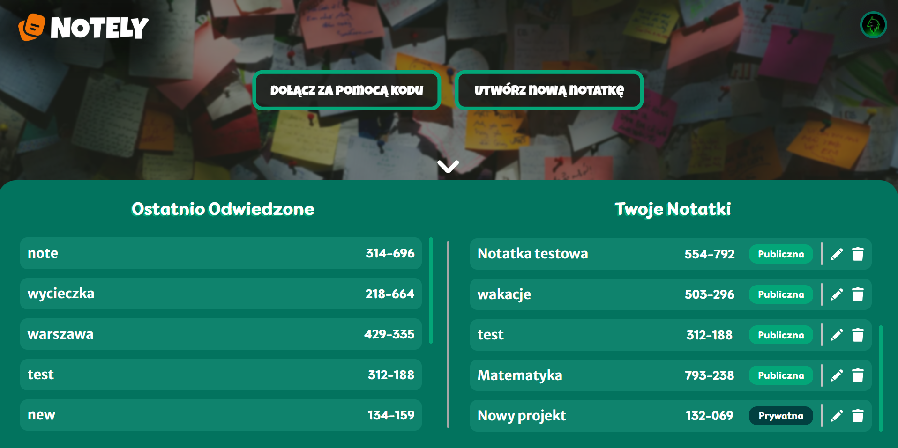
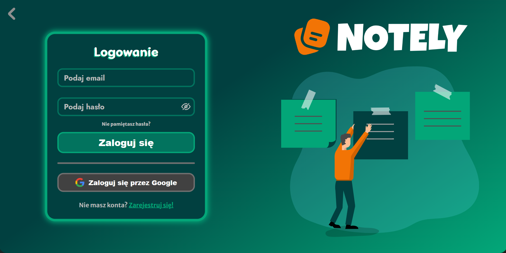
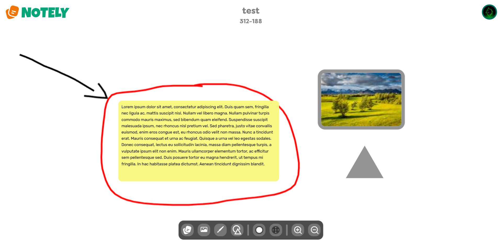
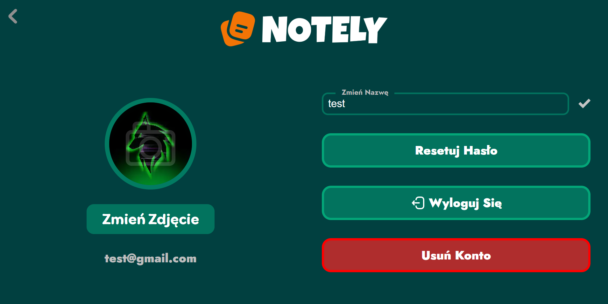

# 📝 Notely – Collaborative Whiteboard App

Notely is a real-time collaborative whiteboard application built with React using Create React App.

The application allows users to create and collaborate on interactive notes with the ability to:

    - Draw freely
    - Add text notes
    - Insert shapes
    - Attach images and videos

The app uses WebSockets technology to enable multiple users to work on the same note live — without refreshing the page.

## 🌍 Live DEMO

The Notely App is available at [https://notelyboard.web.app](https://notelyboard.web.app)

## 📸 Screenshots

### 🏠 Home Page




### 🔐 Login



### 📝 Note example



### 👤 Profile Page



## 🛠️ Technologies used

 - ⚛️ React
 - 🌐 React-router-dom
 - 🎨 Fabric.js
 - 🔌 Socket.IO
 - 📡 Axios

## Api

Application cooperate with a REST API based on Node.

👉 Api repository: [https://github.com/oliwierrosiak/notely-node](https://github.com/oliwierrosiak/notely-node).

## ✨ Features

🔐 Authentication

 - User registration and login
 - JWT-based authorization
 - Password-protected notes

📝 Note Management

 - Create, edit and delete notes
 - Private notes support
 - Join notes via access code
 - Move and scale elements on the board

🎨 Whiteboard Tools

 - Free drawing
 - Text notes
 - Images and video support
 - Shapes support

🤝 Real-time Collaboration

 - Live collaboration via WebSockets
 - Instant updates without page refresh

📱 UX

 - Responsive design
 - User profile editing

## Local installation

```bash
git clone https://github.com/oliwierrosiak/notely-react.git

cd nazwa-projektu

npm install

npm start
```

### App will be available at http://localhost:3000

